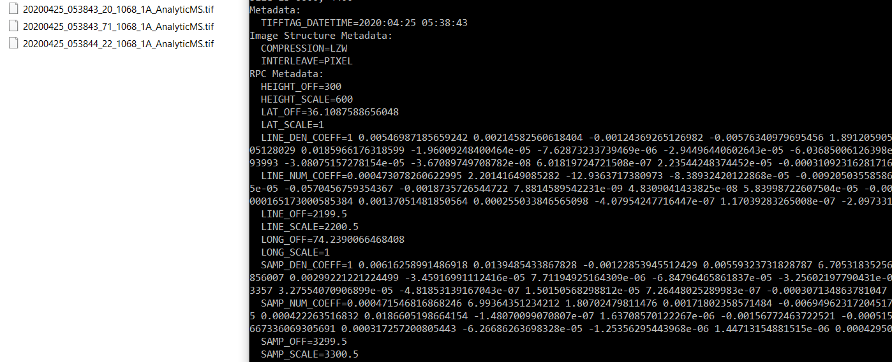
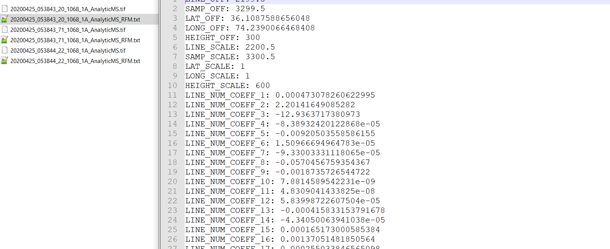

# RPCGeoTag2RPCTxt
Extract RPCs from raster metada (tif,jp2,Ntif) to txt file 
[Saif Aati](mailto:saif@caltech.edu)
    - saif@caltech.edu
    - saifaati@gmail.com
## Dependencies
- See [environment.yml file](/environment.yml) for complete list of Python packages with pinned version numbers.
- [GDAL](https://anaconda.org/conda-forge/gdal)
    
        To install this package with conda run the following:
        conda install -c conda-forge gdal
    

# Installation for RPCGeoTag2RPCTxt

1. Clone the `RPCGeoTag2RPCTxt` repo to the location of your choice using `https://github.com/SaifAati/RPCGeoTag2RPCTxt.git`
2. We recommend using conda for managing packages. Powerusers can have a look at the `environment.yml` file in the github repository to make an environment using that.
3. Otherwise, one can simply initiate a conda environment to avoid conflicts using the environment.yml file.
4. Run the command `conda env create RPCGeoTag2RPCTxt/environment.yml`. This will create a new environment `RPCGeoTag2RPCTxt` containing all dependencies.
5. Activate the environment using `conda activate RPCGeoTag2RPCTxt`.
6. Enter to RPCGeoTag2RPCTxt folder `cd RPCGeoTag2RPCTxt`.
7. Install the repository in editable command: `pip install -e .`. 

## How to use this code:
1- Command line tool mode

    #python RPCGeoTag.RPCTxt.py -h   for help 
    
    -h, --help            show this help message and exit
    -inputPath INPUTPATH  Directory path containing raster files
    -outputPath OUTPUTPATH
                        Directory path where all RPC.txt files will be stored,
                        if this argument kept empty the rpc.txt files will be
                        stored in the same input directory
    #Example: python RPCGeoTag.RPCTxt.py -inputPath "path....."
  
2-Script mode:

    ## If you want to use the script instead of the command line tool, comment line 103 and uncomment the lines from 106 tp 112
    ## Provide the inputPath and the outputPAth (optional)
    class Args:
        def __init__(self):
            self.inputPath= "....."
            self.outputPath=""

    args = Args()
    RunConv(args=args)
    
3- Results:

